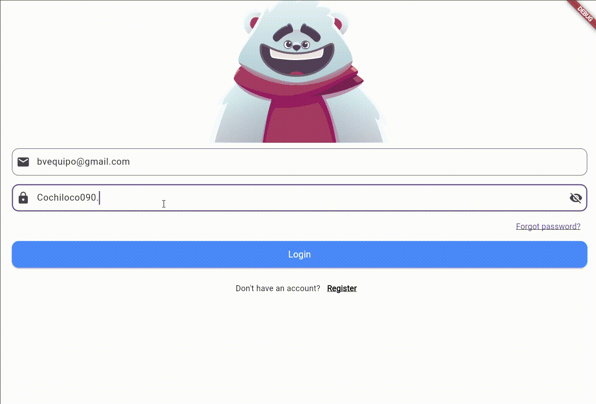

# 🐻 Rive Animated Login Screen – Flutter

An interactive **animated login screen** built with **Flutter** and **Rive**, featuring a responsive bear character that reacts to user interactions in real time using **State Machines**.

This project demonstrates how modern UI animations can be integrated into mobile applications to create more engaging and dynamic user experiences.

---

## 📷 Demo



The GIF above shows the complete behavior of the login screen, including user interaction with the email and password fields and the bear's animated reactions.

---

## 🔥 Overview

This project demonstrates the process of building an animated login interface using **Rive animations integrated into Flutter**.

The main goal is to show how animations can react dynamically to user actions such as typing, focusing input fields, or validating data. Instead of static UI elements, the interface becomes interactive and responsive.

The animation improves the **user experience (UX)** by providing visual feedback and making the login process more intuitive and engaging.

---

## ⭐ Features

- 🧠 **Interactive Rive animation integrated into Flutter**
- 👀 The bear follows the cursor while typing in the email field
- 🙈 The bear covers its eyes when the password field is focused
- 🔒 Password field is hidden by default for security
- 👁️ Toggle button to show or hide the password
- ⚠️ If any input is invalid, the bear reacts with a worried expression
- 🎉 If both fields are valid, the bear reacts with happiness
- 🎯 Real-time animation control using **Rive State Machines**
- 📱 Responsive UI built with Flutter widgets
- 🔄 Dynamic reaction to user input using listeners

---

## 🤖 Rive & State Machines

### What is Rive?

**Rive** is a real-time interactive animation tool used by designers and developers to create animations that can respond to user input.  
Unlike traditional animations (like GIFs or videos), Rive animations can be **interactive**, meaning they can change depending on what the user does.

Rive allows developers to export animations that work on multiple platforms such as:

- Mobile apps
- Web applications
- Games
- Desktop applications

---

### What is a State Machine?

A **State Machine** in Rive is a system that controls how an animation behaves based on different states and conditions.

It works similarly to logic in programming:

- Different **states** represent different animation behaviors.
- **Inputs** (such as triggers or boolean values) control transitions between states.

For example, in this project:

| User Action | Animation Reaction |
|-------------|-------------------|
| User types email | Bear follows cursor |
| Password field selected | Bear covers eyes |
| Invalid input | Bear shows worried reaction |
| Valid input | Bear shows happy reaction |

State Machines allow the animation to react **automatically and smoothly** to user interactions.

---

## 🌐 Technologies Used

This project combines multiple technologies to build the animated login interface:

- 🐦 **Flutter** – Cross-platform UI framework developed by Google
- 🎨 **Rive** – Real-time interactive animation tool
- 🧠 **Rive State Machines** – Used to control animation behavior
- 🎯 **FocusNode** – Detects when input fields gain or lose focus
- 🔍 **Regex** – Used to validate email and password input
- 👂 **Listeners** – Detect changes in user input
- 🎛️ **Controllers** – Manage animation logic and UI interaction
- 📦 **Dart** – Programming language used by Flutter
- 🧑‍💻 **Visual Studio Code** – Development environment used for coding and testing

---

## 🛠️ Project Structure

Below is the basic structure of the project focusing on the main files inside the **lib** folder.

```text
lib/
│
├── main.dart
│   └── Entry point of the application.
│       Initializes Flutter and loads the main screen.
│
├── login_screen.dart
│   └── Builds the animated login UI.
│       Handles user input, validation logic,
│       and communication with the Rive animation.
```text
lib/
│
├── main.dart
│   └── Entry point of the application
│
├── login_screen.dart
│   └── Builds the animated login UI and handles logic
